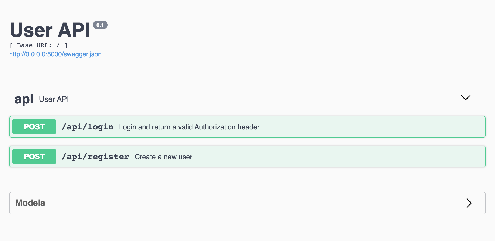

# user-service
User microservice for the Whiteboard Warriors website



## Tech Stack
- Python
- Flask - lightweight micro web framework written in Python
- Flask-Restplus - Flask extension for building REST APIs with swagger documentation
- PostgreSQL - open source object-relational database system
- SQLAlchemy - open-source SQL toolkit and object-relational mapper for the Python


## Installation
```
# Clone repository
$ https://github.com/whiteboard-warriors/user-service.git

# Create virtual environment
$ python -m venv env


# Activate the environment
$ source env/bin/activate


# Install dependencies
$ pip install -r requirements.txt


# Create database 'whiteboardwarriorsdb'
$ createdb whiteboardwarriorsdb


# Create .env file for your environment variables
# Sample content of .env file:

POSTGRES_HOST=localhost
POSTGRES_DB=whiteboardwarriors_db
POSTGRES_USER=postgres_user
POSTGRES_PASSWORD=postgres_password
POSTGRES_PORT=5432


# Initialize database
$ python -i init_db.py

# Run server
$ python server.py
```

## File Structure
<pre>
user-service/
  env/
  users/
      __init__.py
      api.py
      app.py
      config.py
      db.py
      models.py
      token_validation.py
  .env
  .gitignore
  init_db.py
  requirements.txt
  server.py

</pre>


## TODO
 - Add Tests
 - Reset Password
 - Update Account
 - Delete Account

## Contributing
1. Fork it!
2. Create your feature branch: `git checkout -b your-branch-name`
3. Commit your changes: `git commit -am 'Add some feature'`
4. Push to the branch: `git push origin your-branch-name`
5. Submit a pull request :p